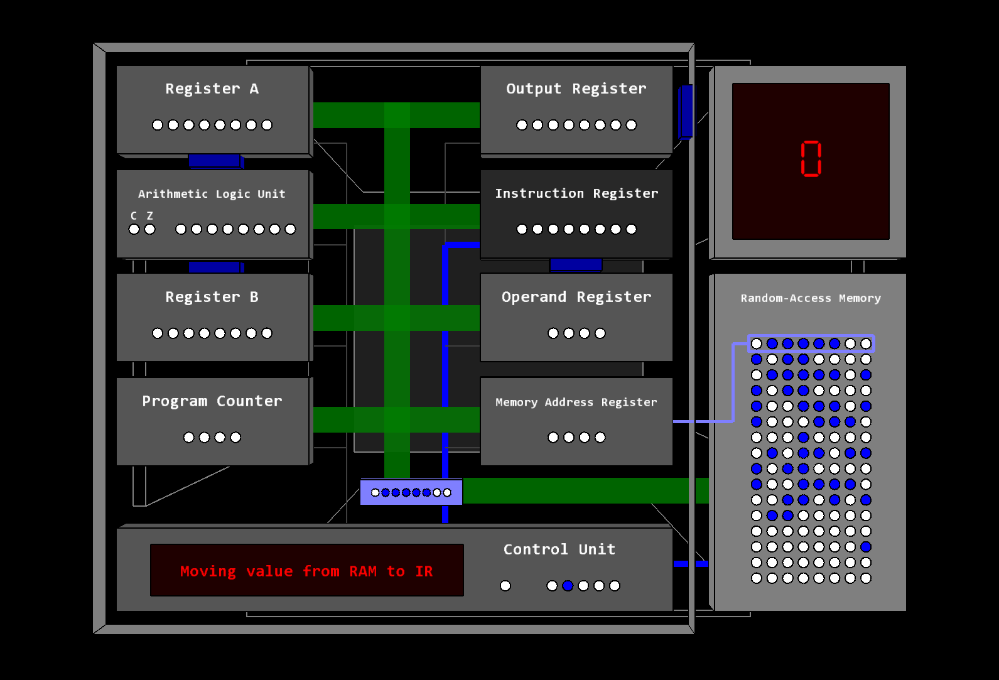

# 8-bit CPU visualisation tool
Tool for visualising and teaching the inner workings of a simple 8-bit processor.

To run this, you need to install [Processing 3](http://processing.org), make sure the `cpu_visualisation` directory contains the `data` directory and the `cpu_visualisation.pde` file and then run the `.pde` file from the Processing IDE.

The GUI is a 3D cube, that can be turned with the arrow keys. Here is a screenshot of the processor view:

## Executable file
At this moment, there is no standalone executable, so it has to be run from the Processing IDE (which is compatible with most platforms though!)

## Manual
**Please note that this is a sketch of the manual and is not complete. Full manual will be provided soon.**

This manual will demonstrate how to set up, start and use the CPU-visualisation tool.

### Setting up

To run the program, download the `.pde` file and the `data` directory and place them in the same folder. Then start the `.pde` file in the Processing IDE.

### Views

The user interface of the application is a three-dimensional cube, that can be spun by the user to navigate between the different views (or pages) of the application. The navigation can be done with the arrow keys, left arrow key to turn the left side towards the user, right key for the right side and so on.
There are five views in the current version of the application. They are the following: the processor view (also known as the main view), the Random-Access Memory (RAM) contents view, the processor component explanation view, the configuration view and the general information view.

#### The processor view

This view, also know as the main view, contain the processor itself including all its components and peripherals, such as the Random-Access Memory and the display. In this view, most of the interesting action is happening. The processor covers most of the view and is in the grey rectangle. The display is in the upper-right corner and displays whatever is in the output register of the processor (more on that later). Finally, the Random-Access Memory is on the lower-right, and is read and written by the processor. It also displays the contents of the 16-byte Random-Access Memory, in binary, one byte per row.

#### The Random-Access Memory contents view

This view shows the Random-Access Memory's contents and explains what each byte means. There are 16 bytes of memory, which is not a lot, but enough to make a functional program to compute things like the first 14 Fibonacci numbers. The program and all data must fit in those 16 bytes, so this makes programming for the processor code golfing in a way (https://en.wikipedia.org/wiki/Code_golf). 
Each row has three columns. The left-most one has the data in a simple on-off format, representing binary (white means 0, blue means 1). In column in the middle the data is in regular binary, in ones and zeros. In the right-most column, the meaning of the data is explained. It is either an instruction or a number, which will be indicated by the text in the column, either "Value [number]" (e.g. "Value 128") or explanation of the instruction (e.g. "Load A from 1101 (13)"). The different explanations are listed below:

* Value [number]: a number literal
* Add B to A: add register A and B and store the result in A
* Subtract B from A: subtract register B from A and store the result in A
* Jump to [address] ([address in decimal]): go to [address] and continue execution from there
* Jump on [flag] to [address] ([address in decimal]): go to [address] if [flag] is set ([flag] is either zero or carry, more on those later)
* Halt: stop execution
* Load [register] from [address] ([address in decimal]): load a value from [address] into [register]
* Store [register] to [address] ([address in decimal]): store [register]'s value into [address]
* Output A: display the value in the accumulator on the display

#### The processor component explanation view

This view simply contains explanations for all the components of the processor, in two columns. The left column contains the name of the part and the right one its task in the processor.

#### The configuration view

In this view, the user may configure the different properties of the processor, such as the speed of execution or the program being executed. All the settings can be adjusted with different keys on the keyboard, indicated by the character(s) in the square brackets on the left. The adjustable settings in this version are: unsigned/signed mode, the executed program and the clock frequency (the execution speed). The processor's state can also be reset from this view.

The unsigned/signed mode setting tells the application whether to use two's compliment or not to display the numbers, or in other words, as the name implies, whether to use signed numbers or not. By using unsigned mode, the processor cannot utilize negative numbers, and the range of numbers it can process is [0, 255]. In signed mode the processor can utilize negative numbers, and the range is [-128, 127]. This setting does not affect the execution itself, but rather the conversion from binary to decimal (i.e. when it shows something on the display).

The executed program can be switched to be "none", "addition" or "fibonacci". The first, "none", is just blank, and does nothing (but is used to reset). The second, "addition", keeps incrementing the accumulator by adding one to it and displays the value on the display. The third program, "fibonacci", computes the first 14 numbers in the Fibonacci sequence, and displays those on the display, one at a time. The reason why it can only go up to 14 is its 8-bitness, so it cannot go over 255, and the 14th Fibonacci number is 233 (the 15th one would cause an overflow).

The clock frequency, which is directly also the execution speed, is the processor's clock's frequency in Hertz. This frequency is the speed at which the clock sends pulses to the processor to do the next operation. The value can be set with the + and - keys to up to 10Hz, with increment/decrement steps of 0.5, except when the value is below 1Hz, then the step is 0.25. When the frequency is set to zero, the displayed text will change to "Manual stepping". This means that the clock can be operated by the user, by pressing the space key, which will send one clock pulse to the processor every time the key is pressed.

The general information view, located on the top instead of one of the sides, contains information about the processor architecture, which in this case is the Von Neumann architecture. This means that every part in the processor has access to the same memory and bus.